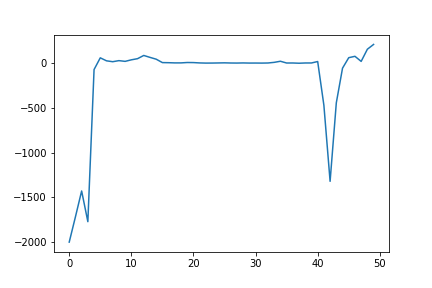
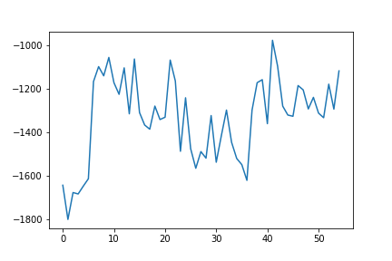
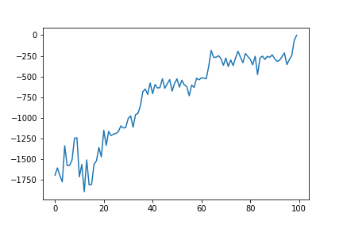

# Experiment

## Algorithm Description
### Stage One
- Multi-Agent Actor-Critic. 
- centralized critic & decentralized actor
- update actor with summation of Q

### Stage Two
#### option one: MAAC
- Multi-Agent Actor-Critic. 
- centralized critic & decentralized actor
- update actor with individual Q, following learned rules

#### option two: MADDPG
- centralized critic & decentralized actor
- update actor with individual Q, following learned rules
- discretize output action


## Harvest
### Environment Description


```
  action space: up/down/right/left/stay,fire,clockwise rotation，
                anticlockwise rotation
  reward function: 
      consume one apple => +1; 
      fire a beam => -1;
      hit by beam => -50;
```

### Result
- Stage one
  - convergence 
  
  - averge reward: 149
- Stage two & option one(MAAC):
  - convergence 
  
  - averge reward

- Baseline: MMAC 

  centralized critic & decentralized actor; 
  
  update actor with individual Q without constrain of socail law.
  - convergence 
  
  - averge reward: 


