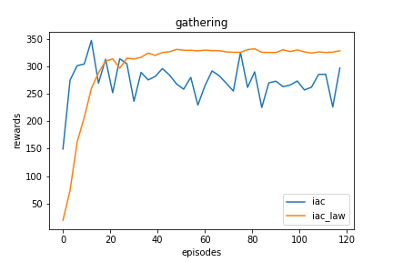

# Experiment

## Baselines

- iac
- ctde-ac
- maac
- coma
- ...

## Environments

- prison dilemma/coin game
- gathering
- harvest/cleanup
- escalator

## Figures

### Experiment on gathering

map

```
...................
...................
...................
.........O.........
........OOO........
........OOO........
.........O.........
...................
...................
...................
```

parameters

```
num of agents: 2
steps: 1000
```

results
  - Convergence 
  
  - Total rewards: 

iac: independent ac

iac_law: iac with social law agents

### Experiment on cleanup


### Experiment on escalator


